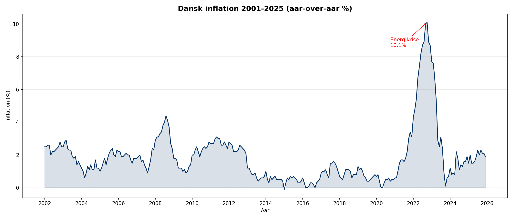
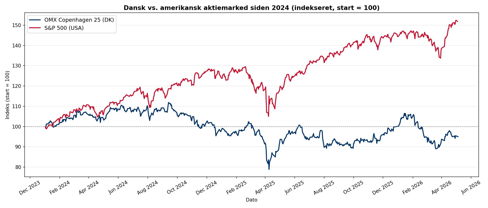

# Dansk Inflationsanalyse & Aktiemarked

Analyse af dansk inflation (2001-2025) og sammenligning af det danske og amerikanske aktiemarked siden 2024.

## Resultater

### Dansk inflation 2001-2025

### OMX Copenhagen 25 vs. S&P 500 siden 2024

- Dansk inflation toppede på 10,1% i oktober 2022 under energikrisen
- Gennemsnitlig inflation i 2022 var 7,67% — det højeste siden årtusindeskiftet
- Inflationen er i 2025 normaliseret til ca. 1,9%
- S&P 500: +51.8% vs. OMX C25: -5.1% siden januar 2024

## Datakilder
- Danmarks Statistik API (forbrugerprisindeks)
- Yahoo Finance (OMX Copenhagen 25, S&P 500)

## Teknologier
- Python 3.13
- pandas, matplotlib, yfinance, sqlite3, requests

## Filer
- `hent_data.py` — henter inflationsdata fra Danmarks Statistik API og gemmer i SQLite
- `analyser.py` — SQL-analyse af inflationsudvikling per år og historiske toppe
- `graf.py` — visualisering af dansk inflation 2001-2025
- `aktiemarked.py` — sammenligning af OMX Copenhagen 25 vs. S&P 500 siden 2024
